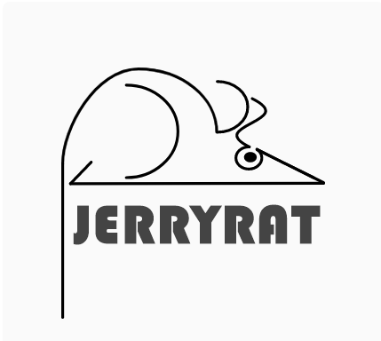

# JerryRat

JerryRat provides marketing solutions to various industry unicorns across the globe. Your products matter and clients are also important to us, why not kick-start the journey with us in furthering enchanting campaigns that best fit to your blueprint? It's our duty to be with you, on the road to success! 

Our team name "JerryRat" is inspired by ["tomcat"](https://en.wikipedia.org/wiki/Apache_Tomcat) is a free and open-source software which provides a HTTP web server environment written in Java which scripts in Java can run on. Additionally, there is a famous cartoon ["Tom and Jerry"](https://en.wikipedia.org/wiki/Tom_and_Jerry), we invert the name of "TomCat" to "JerryRat" with this cartoon. It looks cute, isn't it? :)

Introduction
---

- [People](./docs/team/)
- [Diversity](./docs/diversity.md)
- [Team Principles](./docs/team_principles.md)
- Architecture

Our web app will be deployed on ***Heroku*** and is going to use ***Django*** as the framework. *Apache Spark* will be used to process and analyze the data that will be fed to the ML model. Since the user may change their campaign plan frequently, we are going to use ***Redis*** to save this data while saving personnel info (which is used to train the ML model) in ***Amazon Aurora***. We will use ***XGBoost*** to train a model which takes processed personal information as input and outputs whether this person is worth calling for a promotion. The trained model will be updated regularly based on the most recent data from the database. 

The app will output prospective clients to be called but will only generate the list in CSV. The task dispatching should be done by the companies to their call centers offline

Roadmap
---

The short, medium, and long term goals for project development are written in the [Milestone](https://github.com/dcsil/jerryrat/milestones) of GitHub issues.

Tutorials
---
### Sign Up

### Log In

### Data Entry Page

### Analytics Dashboard

### Calling Operations

### Model Controls

