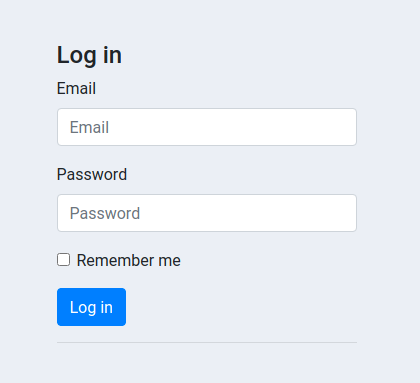
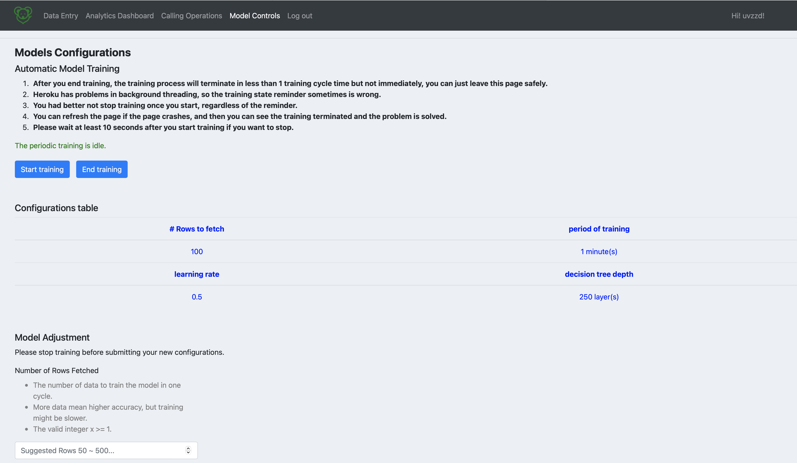

# JerryRat

**JerryRat's URL: https://herokujerryratapp.herokuapp.com/** 
**Note**: When you are running our app for the first time, you may need to wait for a few seconds. Please be patient.

JerryRat provides marketing solutions to various industry unicorns across the globe. Your products matter and clients are also important to us, why not kick-start the journey with us in furthering enchanting campaigns that best fit to your blueprint? It's our duty to be with you, on the road to success! 

Our team name "JerryRat" is inspired by ["tomcat"](https://en.wikipedia.org/wiki/Apache_Tomcat) is a free and open-source software which provides a HTTP web server environment written in Java which scripts in Java can run on. Additionally, there is a famous cartoon ["Tom and Jerry"](https://en.wikipedia.org/wiki/Tom_and_Jerry), we invert the name of "TomCat" to "JerryRat" with this cartoon. It looks cute, isn't it? :)

Introduction
---

- [People](./docs/team/)
- [Diversity](./docs/diversity.md)
- [Team Principles](./docs/team_principles.md)
- [WriteUp](./docs/Final_Software_Writeup.md)
- Architecture

Our web app will be deployed on ***Heroku*** and is going to use ***Django*** as the framework. *Apache Spark* will be used to process and analyze the data that will be fed to the ML model. Since the user may change their campaign plan frequently, we are going to use ***Redis*** to save this data while saving personnel info (which is used to train the ML model) in ***Amazon Aurora***. We will use ***XGBoost*** to train a model which takes processed personal information as input and outputs whether this person is worth calling for a promotion. The trained model will be updated regularly based on the most recent data from the database. 

The app will output prospective clients to be called but will only generate the list in CSV. The task dispatching should be done by the companies to their call centers offline

Roadmap
---

The short, medium, and long term goals for project development are written in the [Milestone](https://github.com/dcsil/jerryrat/milestones) of GitHub issues.

URL
---
https://herokujerryratapp.herokuapp.com 
**Note**: When you are running our app for the first time, you may need to wait for a few seconds. Please be patient.

Sample Heroku logs
---

The log message above is generated by logDNA, an add-on in Heroku as a logger for messages created during running our application. Here is an example of automatic training. This log shows a user starts training the model, one cycle of training finishes, and then end training the model. Later the model is saved and the new accuracy is computed. This happens all in the background, and the training process will not be shown in the front end.

Sample Sentry Alerts
---

This is the Sentry the app hooked up to and some exceptions it recieved.

Write up
---
Please click [here](./docs/Final_Software_Writeup.md) for step-by-step instructions.

Tutorials
---
JerryUp Campainging Master helps you find out the best candidate clients to call in your campaigns, and give clear views on the client population.

### Sign Up

Please sign up before you start. Just follow the instruction here to create your account.

### Log In

Enter your email address and password to log in.

### Data Entry Page

The data entry page is used to upload the client data. Users can click on the “Browse” button to browse the file in the local machine and upload it when confirmed. There are some column descriptions below that explain the exact format the users need to follow, and what each column means. We only accept csv file here. Once clicked on “Upload File”, the data will be fed into the database for analysis or other further usage.

### Analytics Dashboard

There are 7+n graphs in our analytics dashboard. All graphs are bar charts, and the first 7 graphs show how the client conversion rates are different over varying x values, for 7 metrics (client spectrum vs yes/no). In addition, users could add more stacked bar charts about relationships between user profile spectrums (client spectrum 1 vs client spectrum 2), simply by clicking on the add button, and specifying the title and x, y axis in the pop-out window. For each graph, users could toggle the legend to make designated labels visible/invisible. There are also some small add-ons in the bottom widgets, including saving the graph, general zoom-in, window zoom-in, reset, etc. Users could also see the detail (x, y) values by hovering the cursor on the graph. Whiling deleting a graph, just click on the red “X” button on the upper right corner.

### Calling Operations

Worthy Client List is a list of clients that have higher probabilities to subscribe to the products as evaluated by the model, and they are the prospective targets to be contacted. The page will show the client numbers, their names and numbers. Users could select the clients they want to call and dispatch the tasks to the call center. (Just a button indicating an imaginary connection, need external API to connect to the cal center)

### Model Controls

In the model control page, you can configure your model performance based on your demands like your user data size. You can input the learning rate of the model, the maximum decision tree size of the model (ourmachine learning model is decision tree based), the number of rows of data used to train the model per cycle, and the period to train the model once. All the settings are shown in the table, once you submit a new set of settings, the table will be updated. And you can also start training your model automatically and periodically in the background. To start training, click the button "start training", there is a reminder (red color text) tells you it is get trained at now. To end training, click the button "end training", there is a reminder (green color text) tells you it is not get trained yet. 

The Heroku has some problem with Python threading, so the content of the colored reminder might be wrong, but if you click “start training”，the model will be trained automatically. If you stop traing and click “stop training”, the automatic training will be stopped in a period and then the page crashes, you can just refresh the page and work as usual. For more instructions for this, please read the description in model control page.

