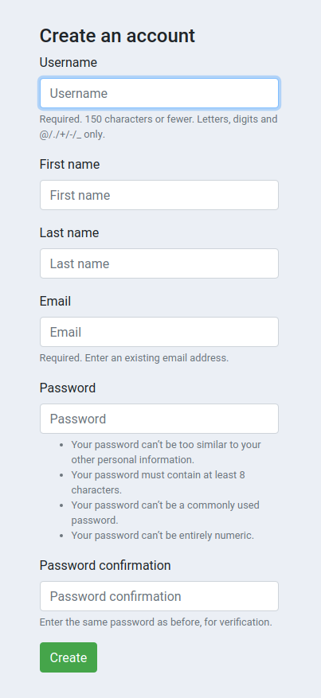
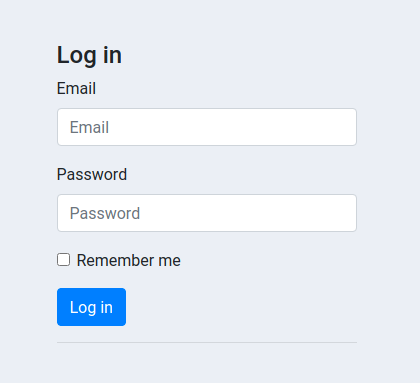
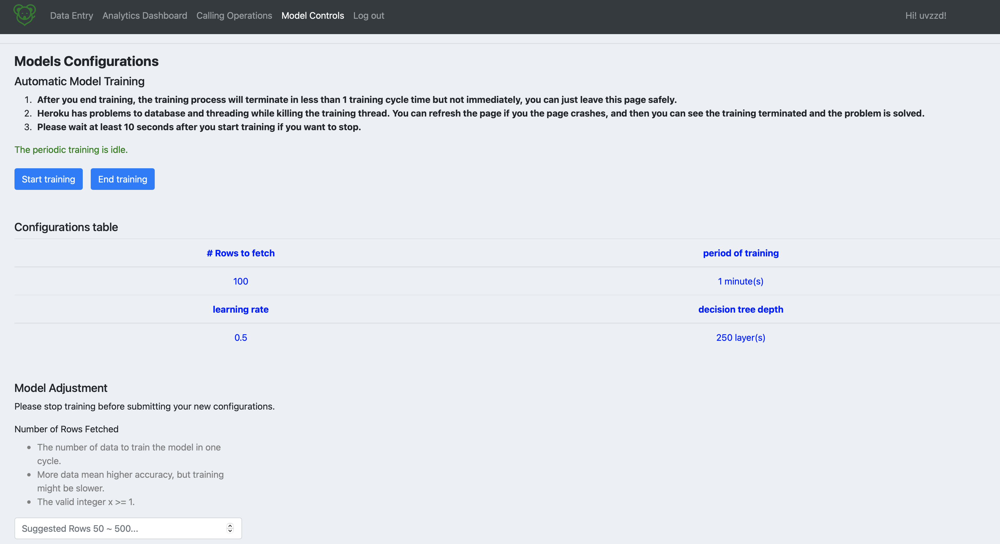

## General Workflow

The user can log into the app and upload the existing client information, and the app will store these client data into our database and do an immediate prediction. The User could go to the Model Control page to adjust the training parameters and control the training process, where the app trains a model based on the current data. Prospective clients will be listed on the Calling Operations page. The user could select all or part of prospective clients in the CO page, and then download them as csv files. 

In the real life (the following is beyond our app), these output csvs are sent to the call centers for actual campaign. After some period of time, there may be calls that lead to real successful subscription to the products, or those that fail to convert clients. These real outputs will be the new ground truths, and they should be combined to the old client base for further training and preiction.

It’s the user’s responsibility to update the information and upload a new csv file to our database.

## Feature Details

### 1. Login and registration: 

   - All features will only be shown to logged in users.
   
### 2. Data Entry Page:

   
   - This is where the user uploads his/her data for the machine learning model to make prediction with.
   - The uploaded data will be automatically fed to the pretrained Machine Learning model.
   - Currently the app only takes data with a fixed format shown in the description, a set of test dataset is provided for you for testing purpose in the MVP-Test folder. Please be aware that other csv files in the repo might not be unusable. They were for other purposes such as function tests.
   - Currently the app only accepts a csv file as input.
   - Since we are not allowed to purchase a higher level JawsDB plan due to their strange policy (a user can't choose a plan for more than 10$ if he/she hasn't made a payment before), please make sure the uploaded file is not too big (which may possibly exceeds the allowed limit!)

### 3. Calling Operation Page:

   - The prediction is reflected here. The user can check a piece of data simply by clicking it.
   - If the user wants, he/she can download that specific campaign prediction by clicking the "Download CSV" button.
   
### 4. Analytic Dashboard:

   - Considering the accessibility of color blindness, when the user hovers his/her mouse over a bar chart, a tag will show up indicating the label name and its value.
   - There are 7+n graphs in our analytics dashboard. All graphs are bar charts, and the first 7 graphs show how the client conversion rates are different over varying x values, for 7 metrics (client spectrum vs yes/no).
   - In addition, users could add more stacked bar charts about relationships between user profile spectrums (client spectrum 1 vs client spectrum 2), simply by clicking on the add button, and specifying the title and x, y axis in the pop-out window. For example, `education` vs `day_of_week` graph shows for people from different educational backgrounds, the numbers of people who respond to the calls in which day of the week.
   - For each graph, users could toggle the legend to make designated labels visible/invisible. There are also some small add-ons in the bottom widgets, including saving the graph, general zoom-in/zoom-out, box select, reset axes, etc. Users could also see the detail (x, y) values by hovering the cursor on the graph. Whiling deleting a graph, just click on the red “X” button on the upper right corner.
   
### 5. Model Control:

   - User can retrain the model with his/her own configuration here.
   - When user clicks "start training" button, the automatic training will begin, and there is a line of red text above notifies the user the model is training, when user clicks "end training" button, the automatic training will end, and there is a line of green text above notifies the user the model is not training.
   - User can see all current model configurations in the table.
   - User can change machine learning model's configurations (period of training, number of rows for training, learning rate, decision tree depth) below.
   - After inputting new values, click "submit" to update settings, and then the table gets refreshed.
