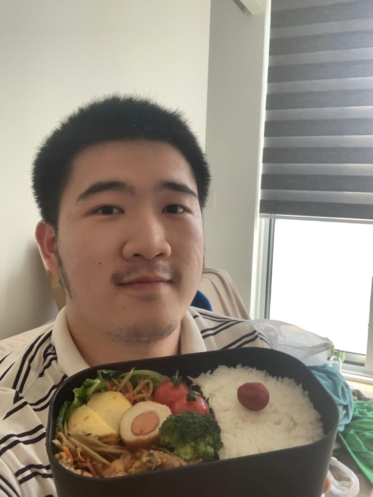

# Hantang (Hunter) Li

- CS Specialist & Data Science Specialist @ UofT
- hantang.li@mail.utoronto.ca

## Links

- [GitHub](https://github.com/Hantang-Li)
- [LinkedIn](https://www.linkedin.com/in/hantang-li-18b77915b/)
- [Resume](https://hantang-li.github.io/resume/)

## About Hunter

Hantang Li is from China Beijing and currently, he is an undergraduate student at UofT. He has experience as a machine learning research engineer. He also worked on computer-vision-related projects such as medical image processing and video understanding. He has the idea of starting his own business or work in a startup company, so he wants to gain experience by getting trained by experts from the industry. That's why he joined this course. He plays video games during his spare time, loves cooking, loves karaoke (although he sings badly) and he likes skateboarding.

## Strengths

- I am serious about any projects I worked on.
- Worked in the industry for a year and am familiar with communicating with bosses and customers
- Most projects that I worked on are related to data processing and analyzing.

## Weaknesses

- I love to solve things independently.
- Limited experience on software development.